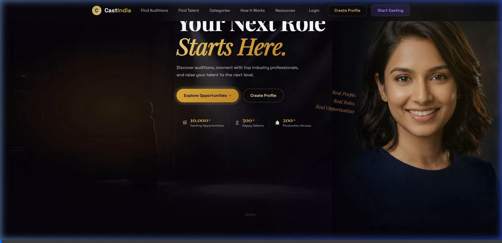

# CastIndia 🎬

> A modern, premium casting platform connecting India's top talent with industry-leading production houses.


## Overview

CastIndia is a cinematic, user-centric web application built to streamline the casting process in the Indian entertainment industry. It serves as a dual-sided marketplace:
- **For Talent:** A professional hub for actors, models, dancers, and musicians to showcase their portfolio, apply to auditions, and get discovered.
- **For Casting Directors & Production Houses:** A powerful tool to post casting calls, manage auditions, and discover verified talent across India.

### Platform Preview


## ✨ Key Features

- **Cinematic UI/UX:** A stunning, dark-mode-first design with amber and violet ambient lighting, glassmorphism elements, and premium typography (Playfair Display).
- **Role-Based Workflows:** Distinct flows for Talent (portfolio creation, job applications) and Casting Teams (project creation, talent shortlisting).
- **Quick Discovery:** Advanced search and filtering by category (Actors, Models, Singers, etc.), location, and language.
- **Responsive Design:** Fully responsive across mobile, tablet, and desktop viewports following a strict 8px grid system.
- **Safety & Trust:** Built-in verification badges, secure profile systems, and privacy controls.

## 🛠 Tech Stack

- **Frontend Framework:** React + Vite
- **Styling:** Vanilla CSS with custom utility classes & CSS variables (no external CSS frameworks)
- **Icons:** Lucide React
- **Routing:** React Router DOM
- **Database / Backend (Planned):** Supabase

## 🚀 Getting Started

### Prerequisites
Make sure you have Node.js (v16 or higher) installed on your machine.

### Installation

1. Clone the repository:
   ```bash
   git clone https://github.com/jayeshbarapatre/CastIndia.git
   ```

2. Navigate to the project directory:
   ```bash
   cd CastIndia
   ```

3. Install the dependencies:
   ```bash
   npm install
   ```

4. Start the development server:
   ```bash
   npm run dev
   ```

5. Open your browser and visit `http://localhost:5173`

## 📁 Project Structure

```text
src/
├── assets/        # Images, icons, and static media
├── components/    # Reusable UI components (Hero, Cards, Footer)
├── contexts/      # React context (Auth, Theme)
├── hooks/         # Custom React hooks (e.g., useScrollReveal)
├── layouts/       # Page layout wrappers (PublicLayout, TalentLayout)
├── lib/           # Third-party integrations (Supabase config)
├── pages/         # Full page views (Home, Auth, Dashboards)
├── index.css      # Global styles, variables, and utility classes
└── App.jsx        # Main application router
```

## 🎨 Design System

The platform uses a strict design system defined in `index.css`:
- **Colors:** Deep cinematic background (`#06040a`), Gold/Amber accents (`#E3A72F`, `#F5D98A`), and Violet highlights.
- **Typography:** `Playfair Display` for primary headings, `Inter` / system-ui for body text.
- **Effects:** Heavy use of radial gradients for ambient lighting, backdrop blurs (glass-panels), and CSS transitions for micro-interactions.

---
*Built for Dreamers, Backed by Industry.*
